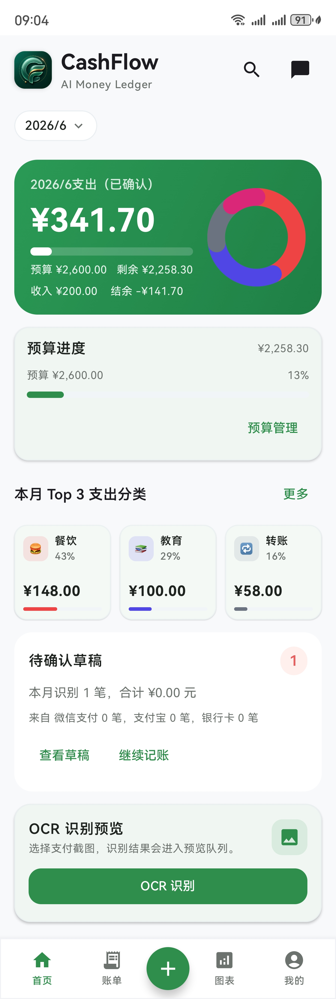
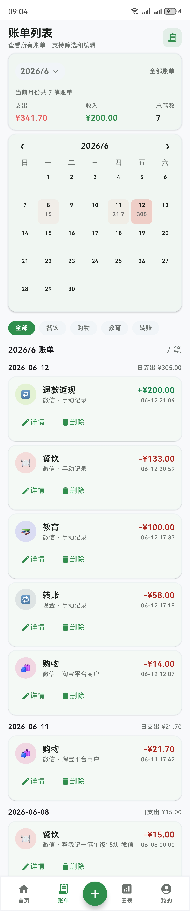
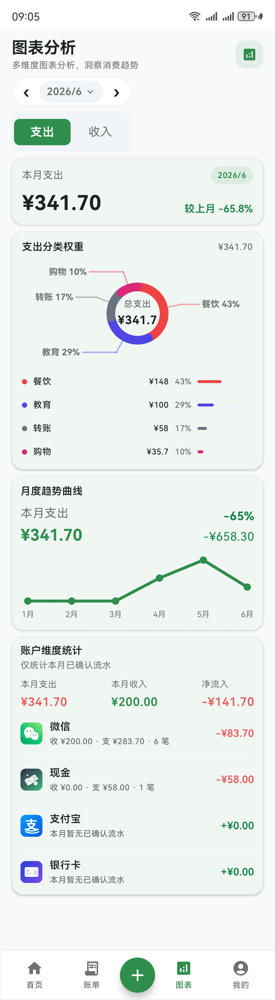
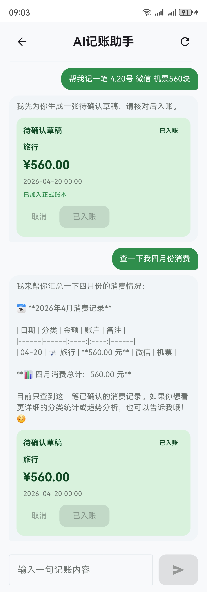
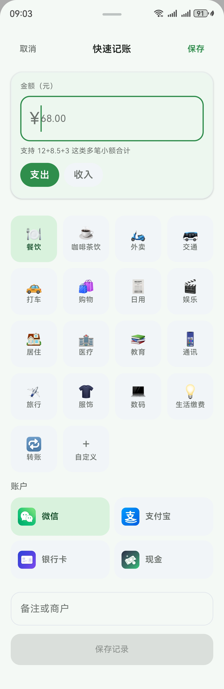
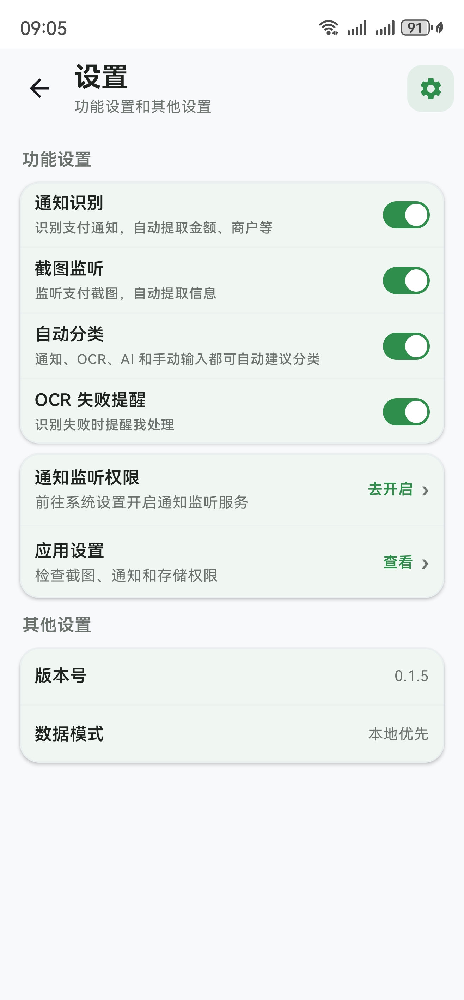

# CashFlow - AI Assisted Android Ledger

CashFlow is a local-first Android ledger app for personal spending records. It combines manual quick entry, payment notification parsing, OCR-based screenshot ingestion, draft review, budget analysis, cloud sync, and AI chat bookkeeping.

This repository is a public showcase snapshot. Secrets, local database files, generated APKs, and private development history are intentionally excluded.

## Download Demo APK

You can try the Android demo build from GitHub Releases:

[Download CashFlow-demo-v0.1.5.apk](https://github.com/khhh-723/cashflow-app-showcase/releases/download/demo-v0.1.5/CashFlow-demo-v0.1.5.apk)

Notes:

- This is a demo/debug APK for portfolio review, not a production app-store release.
- Core local features work without a backend account.
- Cloud sync and AI chat require a separately configured backend and API key.
- Android may show an install warning for APKs downloaded outside an app store.

## Highlights

- **Local-first data model**: Room stores ledger entries, accounts, categories, budgets, draft state, OCR state, and sync metadata.
- **Review-before-posting workflow**: notification, OCR, screenshot, and AI results are saved as drafts first; only confirmed entries affect statistics.
- **Android system integration**: notification listener, foreground screenshot monitor, MediaStore observer, WorkManager OCR jobs, Android Keystore protected auth storage.
- **AI-assisted bookkeeping**: DeepSeek-backed Spring Boot service plus deterministic Android parsing for fast draft cards and local ledger summaries.
- **Full-stack sync path**: Kotlin Android client, Retrofit/OkHttp, Spring Boot API, JWT auth, MySQL, Redis, Flyway migrations, and Docker Compose services.
- **Engineering guardrails**: duplicate detection, release HTTPS checks, R8 config, backup exclusion rules, unit tests for parsing/sync/OCR helpers.

## Screenshots

| Home | Bills | Charts |
| --- | --- | --- |
|  |  |  |

| AI Chat | Quick Entry | Settings |
| --- | --- | --- |
|  |  |  |

## Tech Stack

**Android**

- Kotlin
- Jetpack Compose + Material 3
- Room
- DataStore
- WorkManager
- Retrofit + OkHttp
- Huawei ML Kit OCR
- Android Keystore

**Backend**

- Spring Boot 3.2
- Java 17
- MyBatis-Plus
- MySQL 8
- Redis 7
- Flyway
- JWT
- DeepSeek API

**Infra**

- Docker Compose
- Prometheus
- Grafana
- Gradle

## Architecture

```text
Android App
  Compose UI
  MainViewModel / StateFlow
  Room + DataStore
  Notification Listener / Screenshot Monitor / WorkManager OCR
  Retrofit API Client

        |
        | HTTPS or local debug HTTP
        v

Spring Boot API
  Auth / Sync / Chat / Transactions / Categories
  JWT Security
  DeepSeek AI Integration
  MyBatis-Plus + Flyway

        |
        v

MySQL + Redis
```

## Core Product Rules

- Automatic ingestion never creates confirmed ledger entries directly.
- Drafts are user-reviewable and can be edited, confirmed, ignored, or deleted.
- Statistics only use confirmed entries.
- Amounts are stored in cents and displayed as RMB yuan.
- OCR failures remain visible instead of being silently discarded.
- Local mode remains usable without login.

## Repository Layout

```text
app/        Android client
server/     Spring Boot backend
docker/     Local MySQL, Redis, Prometheus, Grafana
docs/       Product and UI documentation
design/     Showcase screenshots and visual references
tools/      Small local helper scripts
```

## Android Build

Requirements:

- Android Studio with JDK 17
- Android SDK for compileSdk 34
- Gradle wrapper from this repository

Build debug APK:

```powershell
$env:JAVA_HOME = "<path-to-jdk-17>"
$env:Path = "$env:JAVA_HOME\bin;$env:Path"
.\gradlew.bat :app:assembleDebug --stacktrace --no-daemon
```

Default debug backend URL is `http://10.0.2.2:8081/` for Android Emulator. For a physical device, pass a local LAN URL:

```powershell
.\gradlew.bat :app:assembleDebug -Pcashflow.debugApiBaseUrl=http://<your-lan-ip>:8081/
```

Release builds require HTTPS:

```powershell
.\gradlew.bat :app:assembleRelease -Pcashflow.releaseApiBaseUrl=https://api.example.com/
```

## Backend Run

Start local infrastructure:

```powershell
cd docker
$env:MYSQL_ROOT_PASSWORD = "change-me-root"
$env:MYSQL_PASSWORD = "change-me-app"
docker compose up -d
```

Set backend environment variables. See [server/.env.example](server/.env.example).

```powershell
$env:JWT_SECRET = "change-me-dev-jwt-secret-at-least-32-chars"
$env:DB_PASSWORD = "change-me-app"
$env:DEEPSEEK_API_KEY = "<optional-for-ai-chat>"
.\server\gradlew.bat -p server bootRun
```

Health check:

```powershell
Invoke-WebRequest http://localhost:8081/api/health
```

## Tests

Android unit tests:

```powershell
.\gradlew.bat :app:testDebugUnitTest --no-daemon
```

Backend tests:

```powershell
.\server\gradlew.bat -p server test
```

## Security Notes

- No real API keys are committed.
- Generated APKs, databases, logs, `.env` files, and local IDE files are ignored.
- Debug builds may allow local cleartext HTTP for emulator development.
- Release builds require HTTPS API URLs.
- Auth tokens are stored through Android Keystore protected encryption on device.

## Documentation

- [Product Requirements](docs/PRODUCT_REQUIREMENTS.md)
- [UI Specification](docs/PRODUCT_UI_SPEC.md)
- [Project Docs Index](docs/README.md)
- [Strategy PRD](docs/product-strategy/prd-suishouji-2026-06-05.md)
